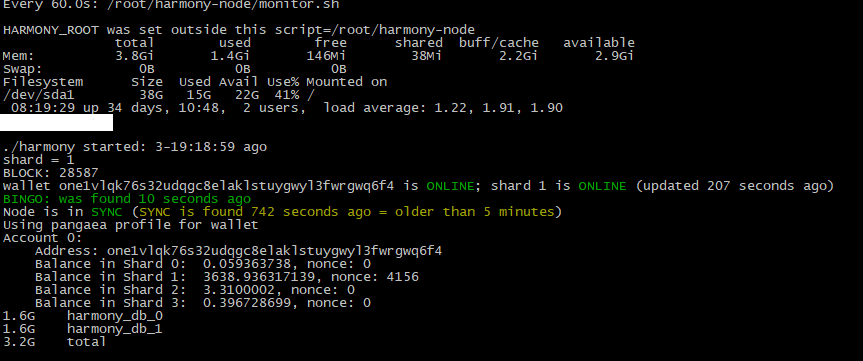
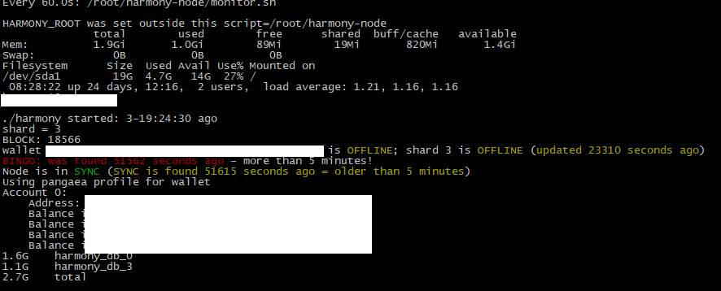

# @AGx10000

random-giveaway.sh  - send random txs to random online wallets in your shard

monitor.sh - monitor node status:
 * mem/disk/cpu stats
 * checks ./harmony is running
 * how long ./harmony is running since last restart (helps to spot when it's accidentaly restarted)
 * shard id
 * latest block
 * wallet balances
 * how much MB is harmony db
 * get wallet/shard status from https://harmony.one/pga/network
 * BINGO - WARN if last one was found 1+/5+ minutes seconds ago
 * SYNC - track SYNC/NOTSYNC messages, track age of these messages

## Installation
these scripts should be installed in a directory which your harmony files are. By default It's your home (`~`) directory.

## Dependencies
`monitor.sh` expects these commands:
 * `jq`: `sudo apt-get install jq`(Ubuntu/Debian/etc) or `sudo yum install jq`(CentOS/RedHat/etc)
 * `curl`: `sudo apt-get install curl`(Ubuntu/Debian/etc) or `sudo yum install curl`(CentOS/RedHat/etc)
 * `pgrep`: `sudo apt-get install procps`(Ubuntu/Debian/etc) or `sudo yum install procps-ng`(CentOS/RedHat/etc)

### Download (update same way)
```shell
cd
wget https://raw.githubusercontent.com/harmony-one/pangaea-community/master/AGx10k/monitor.sh -O monitor.sh
chmod u+x monitor.sh
./monitor.sh
```
^ This will download and run the script *once*.

I am using it on a constant basis - every 60 seconds it updates and shows what has changed. To do it:
```shell
export HARMONY_ROOT=~
alias mon="watch -d -n 60 --color ${HARMONY_ROOT}/monitor.sh"
grep -q "HARMONY_ROOT}/monitor.sh" ~/.bashrc || echo 'alias mon="watch -d -n 60 --color ${HARMONY_ROOT}/monitor.sh"' >> ~/.bashrc'
```
If your Harmony Pangaea scripts are located in a custom dir, just update the 1st string of upper code snippet (export `HARMONY_ROOT="/custom/dir"`)


### Screenshots
Shard1 almost OK (only SYNC is yellow)


Shard3 OFFLINE

