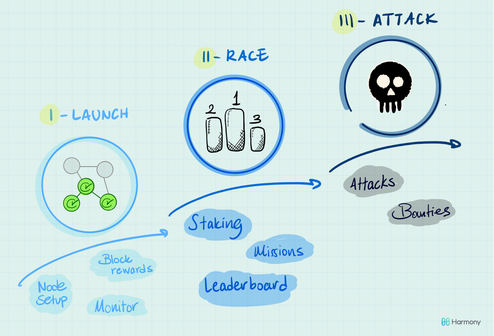

# Introduction to Pangaea

**Pangaea is the name given to Earth’s first and best-known super continent, long before tectonic plates did all their shuffling around to create the planet we live on today. You could say that Pangaea is the ultimate example of a ‘borderless’ environment and evidence that we were all ONE in the beginning.**

We are launching Pangaea — an experimental game for thousands of people to interact with the Harmony network, test the limitations of our technology and have lots of fun while earning rewards. Pangaea is created purely for experimental purposes. It will have its own currency for playing and bookkeeping.

## The goals of Pangaea:

* Test Harmony’s upcoming core protocol milestones and updates such as staking smart contracts and resharding, on a network of all external nodes
* Set-up and onboard a vast number of nodes, ready to jump into the mainnet, through collective knowledge building and competitions
* Identify and award community members who help secure Harmony network and are willing to go the extra mile by taking on leadership roles in our validator community

## Who can participate?

**EveryONE** — the more the merrier! To create a fully secure, permission less, and sharded blockchain we need lots and lots of nodes. If you’ve previously thought running a node was too technical or expensive, this is a great opportunity to give it a go.

If you want to get your hands dirty and play with the network, this is the way to go! Become a node, learn on the go, secure Pangaea and get the chance to become a node in Mainnet with its stake sponsored by Harmony.

In addition, you will win prizes for maintaining superior network performance during the game.

Technical requirements:

* Minimum of 2 cores, 2G RAM, 30G hard drive
* AWS t3.small or equivalent from other cloud provider

### The 3 phases of Pangaea

Each phase of Pangaea serves a different purpose. Our goal is to create a natural transition from setting up your node to achieving stability, and then to start competing in various challenges to strengthen the Pangaea network.

#### Phase I \(Aug 15th — 29th\) ~14 days

The launch phase. The main purpose is to get hundreds of nodes to successfully join Pangaea. We understand that ‘running a blockchain node’ does not come naturally to everyone; so our team will help you with the set up, answer your questions, and bug you with ‘surprise quizzes’ to make sure you are learning! Beware, you will be able to transfer and stake your rewards in the next phases.

Goals:

* Setup your node and join the network
* Check your balances, block rewards and redeem your daily tokens from the faucet
* Monitor the stability of your node

#### Phase II \(Sep 10th - 24th\) ~14 days

In this phase, the nodes will work together to maximize performance and complete missions, such as sending transactions and using staking smart contracts.

Goals:

* Complete “missions” \(e.g., sending tokens transactions to other players\)
* Compete on key performance metrics such as uptime, block rewards and latency

#### Phase III \(Tentative\)

This is where things will get messy, and more entertaining for the seasoned hacker. We want to test the limits of security and stability of our network by incentivizing evil behavior. This may come in various forms: a\) you can win prizes for breaking things and b\) you may find yourself with ‘super powers’ randomly given by Harmony, and asked to use them in an adversarial way.

Goals:

* Organize individual or group attacks
* Identify and submit security bugs

### Game rewards

We want to make sure that everyone is rewarded for the work they put into Pangaea. This means covering the basic costs of operating a node as well as additional incentives for those who go above and beyond.

### How to contribute your scripts/code to Pangaea

We welcome community contributed scripts/code.

To do this

* Fork this github repo
* Create a folder in the format yourgithubrepo/yourproject
* Add your script/code. Create a Readme.md file describing what the script does
* Request a pull/merge (Please make sure to mention your Telegram/Discord username)

